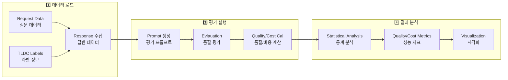
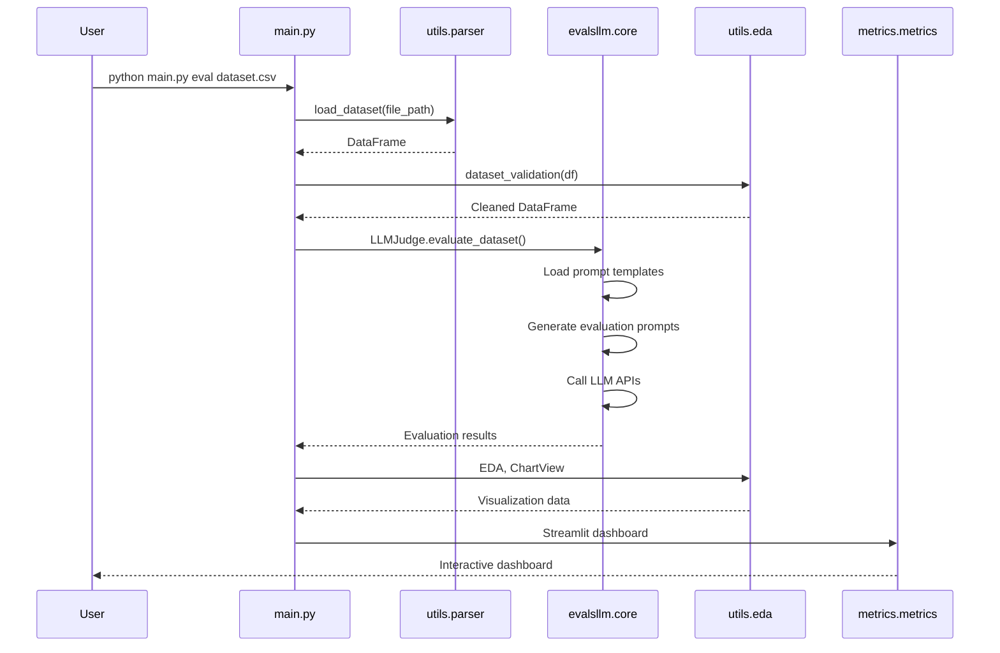
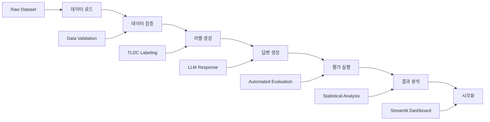
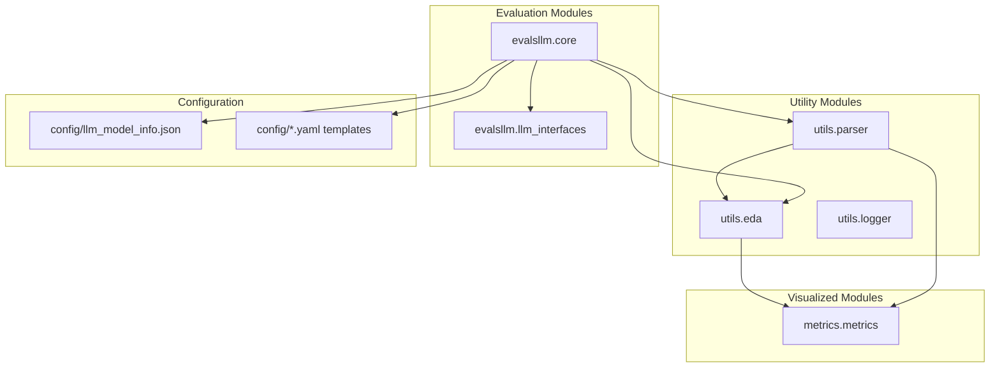
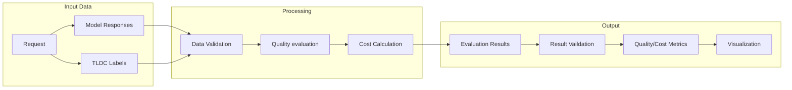

# EVAL_TOOL

대규모 언어 모델(LLM) 평가를 위한 종합적인 도구입니다. 다양한 LLM 모델의 성능을 평가하고 비교 분석할 수 있는 기능을 제공합니다.

## 🚀 주요 기능

### 1. LLM 평가 시스템
- **다중 모델 평가**: GPT-4, GPT-4o, MidM, Llama 등 다양한 LLM 모델 지원
- **자동화된 평가**: 프롬프트 기반 자동 평가 시스템
- **다양한 평가 기준**: 사실 정확성, 논리적 추론, 창의성 등

### 2. 데이터 처리 및 분석
- **데이터 로딩**: CSV, Parquet, JSON 형식 지원
- **데이터 클렌징**: 결측값 처리, 데이터 검증
- **통계 분석**: 모델별 성능 통계 및 분포 분석

### 3. 시각화 및 대시보드
- **Streamlit 기반 웹 대시보드**: 인터랙티브한 데이터 시각화
- **히트맵**: 모델별 성능 매트릭스 시각화
- **분포 차트**: 모델 성능 분포 및 비교 차트

### 4. 비용 분석
- **토큰 기반 비용 계산**: 입력/출력 토큰별 비용 분석
- **가성비 분석**: 성능 대비 비용 효율성 평가

## 🔄 데이터 파이프라인



## 🔄 평가 워크플로우



## 📁 프로젝트 구조

```
eval_tool/
├── config/                    # 설정 파일
│   ├── llm_model_info.json   # LLM 모델 정보 및 가격
│   ├── Judge_template.yaml    # 평가 프롬프트 템플릿
│   ├── Reason_template.yaml   # 추론 평가 템플릿
│   ├── Creative_template.yaml # 창의성 평가 템플릿
│   └── ...
├── dataset/                   # 데이터셋
│   ├── 1.request_data/       # Request(w.TLDC) 데이터
│   ├── 2.answer_data/        # 모델 답변 데이터
│   ├── 3.eval_data/          # 평가 데이터
│   ├── 4.eval_result_data/   # 평가 결과 데이터
│   └── 5.metrics_data/        # 매트릭스 분석용 데이터
├── evalsllm/                 # LLM 평가 코어 모듈
│   ├── core.py               # 평가 로직 및 프롬프트 관리
│   └── llm_interfaces.py     # LLM 인터페이스
├── metrics/                   # 메트릭 및 분석
│   └── metrics.py            # Streamlit 대시보드
├── utils/                     # 유틸리티 함수
│   ├── parser.py             # 데이터 파싱 및 처리
│   ├── eda.py                # 탐색적 데이터 분석/차트 생성
│   └── logger.py             # 로깅 시스템
├── response/                  # 응답 생성 모듈
│   └── response.py
├── main.py                   # 메인 실행 파일
└── pyproject.toml           # 프로젝트 설정
```

## 🛠️ 설치 및 설정

### 1. 환경 요구사항
- Python 3.11+
- uv 패키지 매니저

### 2. 설치
```bash
# 저장소 클론
git clone <repository-url>
cd eval_tool

# 의존성 설치
uv sync
```

### 3. 환경 설정
```bash
# .env 파일 생성 (선택사항)
cp .env.example .env
```

## 🚀 사용법

### 1. 전체 워크플로우



### 2. 메인 실행
```bash
# 실행 option
print("Usage: python main.py <option> <file_path>")
print("<action> : label / prompt / eval / metrics ")
print("Example: python eval main.py dataset/sample.csv")


# 평가 실행
python main.py eval dataset/sample.csv

# 메트릭 분석
python main.py metrics 

# 평가 prompt생성
python main.py prompt dataset/sample.csv

# 응답 생성
python main.py response dataset/sample.csv

# tldc 라벨링
python main.py label dataset/sample.csv
```

### 3. Streamlit 대시보드
```bash
# 메트릭 대시보드 실행
streamlit run metrics/metrics.py

```

### 3. 개별 모듈 사용
```python
from utils.parser import load_dataset, dataset_clean
from evalsllm.core import LLMJudge
from utils.eda import ChartView

# 데이터 로드
df = load_dataset('dataset/sample.csv')

# 데이터 클렌징
df_clean = dataset_clean(df)

# 평가 실행
judge = LLMJudge()
results = judge.evaluate_dataset(df_clean)
```

## 📊 주요 모듈

### 모듈 구조도



### 1. evalsllm.core
LLM 평가의 핵심 로직을 담당합니다.

**주요 클래스:**
- `LLMJudge`: 평가 실행 및 관리
- `PromptTemplate`: 프롬프트 템플릿 관리
- `LLMJudge()`: 평가 인스턴스 생성
- `create_multi_criteria_prompt()`: 평가 프롬프트 생성
- `run_evaluation_on_dataset()`: 평가 실행


**주요 기능:**
- 다중 모델 평가
- Task별 평가 프롬프트 생성
- 프롬프트 기반 자동 평가


### 2. utils.parser
데이터 처리 및 파싱을 담당합니다.

**주요 함수:**
- `load_dataset()`: 다양한 형식의 데이터 로드
- `dataset_clean()`: 데이터 클렌징 및 전처리
- `load_llm_model_info()`: LLM 모델 정보 로드
- `dataset_validation()`: 데이터 검증

**주요 기능:**
- 데이터 로드, 검증
- 결과 파싱 및 저장


### 3. utils.eda
탐색적 데이터 분석 및 시각화를 담당합니다.

**주요 클래스:**
- `EDA`: 데이터 분석 도구
- `ChartView`: 차트 생성 및 시각화


**주요 기능:**
- 데이터 분포 분석
- 모델별 성능 비교
- 히트맵 생성

### 4. metrics.metrics
Streamlit 기반 대시보드를 제공합니다.

**주요 기능:**
- 인터랙티브 데이터 시각화
- 모델별 성능 분석
- 비용 효율성 분석

## 🔧 설정

### 1. LLM 모델 설정
`config/llm_model_info.json`에서 지원하는 LLM 모델을 설정할 수 있습니다:

```json
{
    "gpt_4_1": {
        "id": "gpt-4.1-2025-04-14",
        "alias": "gpt-4.1",
        "url": "https://api.example.com/...",
        "api_key": "your-api-key",
        "price": {
            "dollar_per_input_token": 0.000002,
            "dollar_per_output_token": 0.000008
        }
    }
}
```

### 2. 평가 프롬프트 설정
`config/` 폴더의 YAML 파일에서 평가 프롬프트를 커스터마이징할 수 있습니다:

- `Judge_template.yaml`: 일반 평가 템플릿
- `Reason_template.yaml`: 추론 평가 템플릿
- `Creative_template.yaml`: 창의성 평가 템플릿
- `Knowledge_template.yaml`: 지식 평가 템플릿
- `Summary_template`: 요약 평가 템플릿
- `Translate_template`: 변역 평가 템플릿

## 📈 평가 기준

### 1. 사실 정확성 (Knowledge)
- 사실 정확성 (30%)
- 세부 정보 신뢰도 (15%)
- 근거 제시 여부 (15%)
- 오정보 여부 (20%)
- 완전성 (20%)

### 2. 논리적 추론 (Reasoning)
- 논리적 순서 (25%)
- 단계 간 연결성 (15%)
- 과정의 정확성 (25%)
- 단계 완전성 (10%)
- 최종 결과의 정확성 (25%)

### 3. 창의성 (Creative)
- 창의성 (35%)
- 구성도 (20%)
- 몰입도 (20%)
- 전달력 (15%)
- 톤/스타일 (10%)

### 4. 요약형 (Summary)
- 핵심내용 (350%)
- 불필요 배제 (25%)
- 간결성 (20%)
- 논리적 흐름 (20%)
- 적합성 (10%)

### 5. 번역 (Translate)
- 정확성 (350%)
- 자연스러움 (25%)
- 문법/표현 (20%)
- 톤/스타일 (20%)

## 🔍 데이터 형식

### 데이터 플로우



### 입력 데이터 형식
```csv
id,label_task,label_level,label_domain,messages,answerer_llm_alias,response,eval_result
1,"T1","L1","D1","질문 내용","gpt-4","답변 내용","평가 결과 JSON"
```

### 평가 결과 형식
```json
{
    "총점": 0.85,
    "사실정확성": 0.9,
    "논리적추론": 0.8,
    "창의성": 0.85
}
```

## 🚀 고급 사용법

### 1. 커스텀 평가 기준 추가
```python
from evalsllm.core import EvaluationCriteria

# 새로운 평가 기준 정의
custom_criteria = EvaluationCriteria(
    name="custom_evaluation",
    prompt_template="custom_template.yaml",
    scoring_method="weighted_average"
)
```

### 2. LLM 모델 연동
```python
from evalsllm.llm_interfaces import LLMInterface

class CustomLLM(LLMInterface):
    def generate_response(self, prompt: str):
        # 커스텀 LLM 구현
        pass
    
    def get_model_name(self):
        return "custom-model"
```

### 3. 배치 처리
```python
# 대용량 데이터셋 배치 처리
from utils.parser import load_dataset
from evalsllm.core import LLMJudge

df = load_dataset('large_dataset.csv')
judge = LLMJudge()

# 배치 크기 설정
batch_size = 100
for i in range(0, len(df), batch_size):
    batch = df.iloc[i:i+batch_size]
    results = judge.evaluate_dataset(batch)
```

## 📊 성능 최적화

### 1. 캐싱
- Streamlit의 `@st.cache_data` 데코레이터 사용
- 데이터 로딩 최적화

### 2. 병렬 처리
- 비동기 처리로 API 호출 최적화
- 배치 처리로 메모리 효율성 향상

### 3. 데이터 압축
- Parquet 형식 사용으로 저장 공간 절약
- 압축된 데이터 로딩

## 🐛 문제 해결

### 1. 일반적인 문제
- **JSON 파싱 에러**: `utils/parser.py`의 `parse_json_block_safely()` 함수 사용
- **메모리 부족**: 배치 크기 조정
- **API 제한**: 요청 간격 조정

### 2. 로그 확인
```bash
# 로그 파일 확인
tail -f logs/app.log
```


## 📄 라이선스

이 프로젝트는 MIT 라이선스 하에 배포됩니다.

## 📞 지원

문제가 발생하거나 질문이 있으시면 이슈를 생성해 주세요.

---

**EVAL_TOOL** - LLM 평가를 위한 강력하고 유연한 도구
